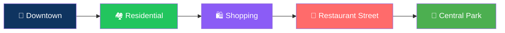
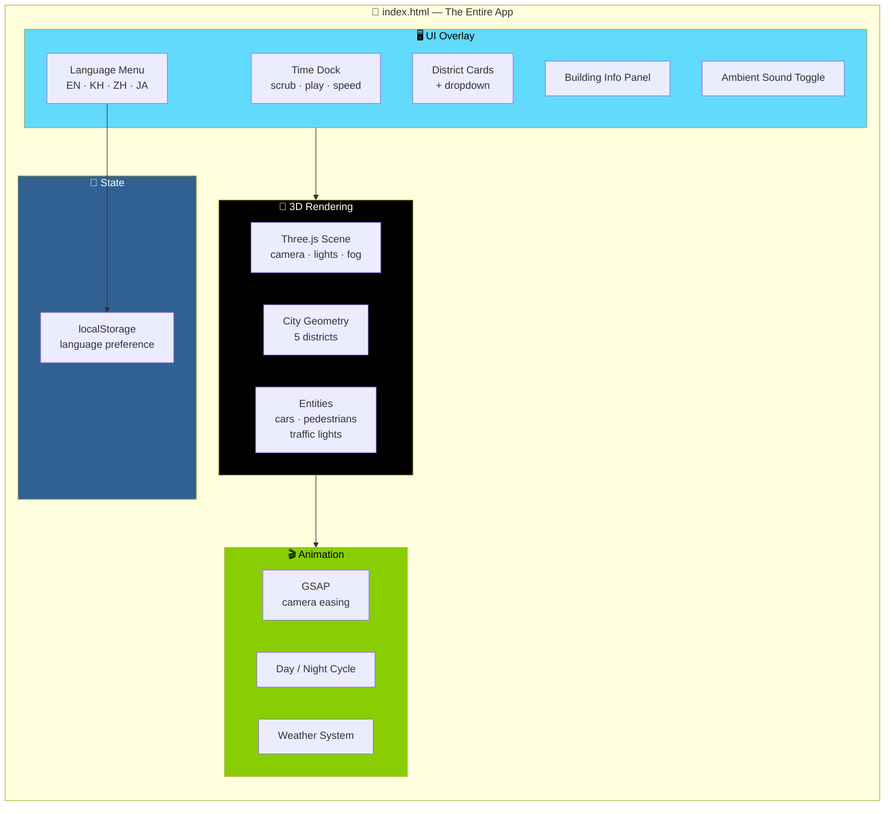

# 🏙️ Tiny City — A Day in a Tiny City

<div align="center">


**A single-file, self-contained 3D interactive miniature city.**

*Cars · Pedestrians · Traffic lights · Weather · Day/night cycle — across five districts*

[🏙️ Overview](#-overview) • [📁 Files](#-files) • [🐛 What Was Fixed](#-what-was-fixed) • [🎮 How to Use](#-how-to-use) • [🛠️ Tech](#-tech-used)

</div>

---

## 📖 Overview

**Tiny City** is a **single-file, self-contained 3D interactive miniature city** built with **Three.js**.

Watch cars, pedestrians, traffic lights, weather, and a day/night cycle play out across **five districts** — in **English, Khmer, Chinese, or Japanese**.

### The Five Districts



### 🌐 Four Languages

🇬🇧 English · 🇰🇭 Khmer · 🇨🇳 Chinese · 🇯🇵 Japanese

**Your choice is remembered** on next visit via `localStorage`.

---

## 📁 Files

```
tiny-city/
└── index.html      # The entire app — HTML, CSS, and JS in one file
```

> 💡 **Just open it in a browser.** No build step. No server required.

---

## 🐛 What Was Fixed

> **The original file had one real functional bug and a few small pieces of dead code.**
>
> **Here's exactly what changed.**

### 1. 🐞 "Restaurant Street" Card Did Nothing When Clicked *(the main bug)*

**The problem:**

- The district card had `data-preset="restaurant"`
- But the camera-preset dropdown only listed `city / downtown / residential / shopping / park / night`
- There was **no `restaurant` option** and **no matching entry in the `cameraPresets` object**
- So clicking the card set the dropdown to a value that didn't exist
- And `flyTo("restaurant")` returned immediately **without moving the camera**

**The fix:**

| Change | Detail |
|--------|--------|
| ✅ Added a **real `restaurant` camera preset** | Positioned over that district's actual location in the grid |
| ✅ Added a matching **`<option>`** in the dropdown | So the value exists |
| ✅ Added **translated labels** for it | In all four languages |

### 2. 🧹 Dead / Unreachable Code Cleaned Up

<div align="center">

| What Was Removed | Why |
|-----------------|-----|
| **`scene.fog.density;`** | A no-op statement — reading a property and discarding it |
| **`if (hh >= 24)` branch** in the clock formatter | Could **never run**, since `hh` is always taken `% 24`. Simplified to a single AM/PM check |
| **Unused `isBuildingOpen()` helper** | Left over from an earlier version of the logic — never used |
| **Unused `targetEmissive` variable** | Left over from the night-lighting loop — never used |
| **Redundant `swapAxis` parameter** on the street-lamp builder | Did the exact same thing in both branches — removed for clarity |

</div>

### 3. 🔧 Small Robustness Fix

**The ambient sound toggle** now **resumes the `AudioContext`** if the browser created it in a **suspended state**.

> 💡 **Some mobile browsers do this even on a click** — so this fix ensures sound reliably starts on first tap.

### ✅ Everything Else Was Already Working

**Untouched:**

- Day/night cycle
- Weather toggle
- Language switcher
- Car / pedestrian traffic
- Building info panel
- Camera flythroughs
- Stats counters

---

## 🎮 How to Use

### 1. Open It

Unzip and open **`index.html`** in any modern desktop or mobile browser:

- Chrome · Safari · Firefox · Edge

> ⚠️ **An internet connection is needed the first time** — Three.js, GSAP, Tailwind, and the Google Fonts are loaded from public CDNs.

### 2. Camera Controls

| Input | Action |
|-------|--------|
| **Drag** | Orbit |
| **Scroll / pinch** | Zoom |

### 3. Time Dock *(bottom)*

- **Scrub** through the day
- **Play / pause**
- **Change speed**

### 4. Click a Building

See its:

- Name
- Type
- Floor count
- Population
- Hours

### 5. District Cards

Use the **district cards** or the **dropdown** to fly the camera to a specific part of the city.

### 6. Switch Language

From the **top-right menu**:

🇬🇧 🇰🇭 🇨🇳 🇯🇵

> 💡 **Your choice is remembered** on next visit via `localStorage`.

---

## 🏗️ Architecture



### Component Breakdown

| Layer | Responsibility |
|-------|---------------|
| **🎨 3D Rendering** | Three.js scene, camera, lights, fog; city geometry across five districts; cars, pedestrians, and traffic lights |
| **🎬 Animation** | GSAP for camera easing; day/night cycle; weather system |
| **🖥️ UI Overlay** | Time dock (scrub / play / speed); district cards and dropdown; building info panel; language menu; sound toggle |
| **💾 State** | `localStorage` — remembers your language preference |

---

## 🛠️ Tech Used

| Library | Purpose |
|---------|---------|
| **Three.js (r128)** + OrbitControls | 3D scene, camera, controls |
| **GSAP** | Camera easing |
| **Tailwind CSS** *(via CDN)* | Layout utilities |
| **Google Fonts** — Unbounded · Inter · Noto Sans Khmer / SC / JP | Typography |

> 💡 **Everything loads from public CDNs on first visit — no build step, no npm install.**

---

## 🌐 Browser Support

| Browser | Status |
|---------|--------|
| Chrome (desktop & mobile) | ✅ Full Support |
| Firefox (desktop & mobile) | ✅ Full Support |
| Safari (desktop & iOS) | ✅ Full Support |
| Edge (desktop) | ✅ Full Support |

> ⚠️ **Requires WebGL.** Very old devices or browsers without WebGL support **won't render the scene** *(Tailwind/CSS UI will still load)*.

---

## 📝 Known Limitations

<div align="center">

| Limitation | Details |
|-----------|---------|
| **Requires WebGL** | Very old devices/browsers without WebGL support won't render the scene — Tailwind/CSS UI will still load |
| **Generated data** | All data — traffic, building stats, weather — is **generated client-side for atmosphere**. It isn't tied to a real place or real data |

</div>

---

## 🗺️ Roadmap

### ✅ Current

- [x] Single-file self-contained app
- [x] Five districts: Downtown, Residential, Shopping, Restaurant Street, Central Park
- [x] Day/night cycle with scrub, play/pause, and speed controls
- [x] Weather toggle
- [x] Car and pedestrian traffic
- [x] Traffic lights
- [x] Building info panel with name, type, floors, population, hours
- [x] Camera flythroughs via district cards and dropdown
- [x] Four languages: English, Khmer, Chinese, Japanese
- [x] Language preference persisted to `localStorage`
- [x] Ambient sound toggle with AudioContext resume fix
- [x] OrbitControls for drag-to-orbit and zoom
- [x] GSAP camera easing
- [x] **Fixed: Restaurant Street card now flies the camera correctly**
- [x] **Cleaned up: dead and unreachable code removed**
- [x] **Robustness: ambient sound starts reliably on first tap**

### 🔜 Future Ideas

- [ ] Additional districts (industrial, waterfront, nightlife)
- [ ] More languages
- [ ] Custom time-of-day presets
- [ ] Seasonal weather variations
- [ ] Zoom-to-district on the minimap
- [ ] More animated entities (birds, boats, balloons)
- [ ] Photo mode with camera position save
- [ ] Background music tracks per district

---

## 🤝 Contributing

Contributions are welcome. Please:

1. Fork the repository
2. **Keep it single-file** — no external build step or module bundler
3. **Preserve the multi-language support** — every UI string needs all four translations
4. **Test camera presets** — the Restaurant Street bug is what happens when a preset is referenced but never defined
5. Test on both desktop and mobile
6. Submit a Pull Request

### Guidelines

- **Never add a required build step** — the whole point is `index.html` and nothing else
- **Never break a district card** — every `data-preset` must have a matching `cameraPresets` entry and a matching `<option>`
- **Never leave dead code** — the recent cleanup is the standard
- **Never assume AudioContext starts running** — always resume on user gesture

---

## 📜 License

MIT — see [LICENSE](LICENSE) for details.

---

## 🙏 Acknowledgments

- **Three.js** — for making miniature 3D worlds this satisfying
- **GSAP** — for camera easing that feels natural
- **Every user who clicked a card and nothing happened** — this fix is for you

---

<div align="center">

### 🏙️ WATCH. EXPLORE. SCRUB. FLY.

**A tiny city, in a single file.**

**Five districts. Four languages. Zero build steps.**

<br>

⭐ If you enjoyed this tiny world, consider giving it a star.

<br>

[⬆ Back to Top](#️-tiny-city--a-day-in-a-tiny-city)

</div>
